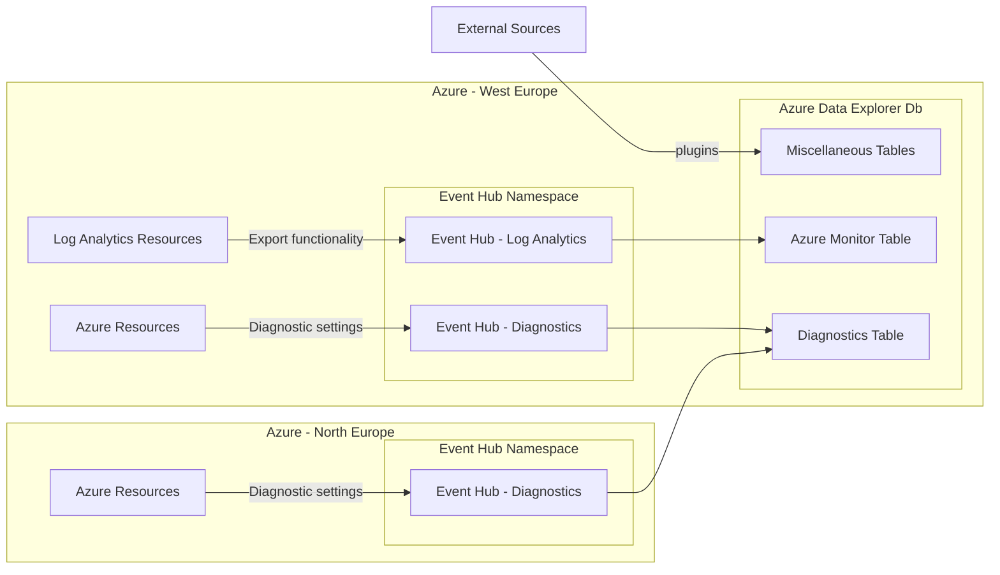

# Streaming logs from LAW to a Kusto Cluster 🤽🏻‍♂️ #

[![CC BY-NC-SA 4.0][cc-by-nc-sa-shield]][cc-by-nc-sa]

Log Analytics Workspace export to Event Hub to Kusto Cluster (Azure Data Explorer Cluster).

Some bits were from the [azure-quickstart-templates](https://github.com/Azure/azure-quickstart-templates/blob/master/quickstarts/microsoft.kusto/kusto-event-hub/main.bicep), but i took the cheapest SKUs and the simplest testable setup, batteries included.

## Configuration ##

1. `privateDnsZoneGroups` for the Kusto private endpoint can be deployed via the [policy_definition_configure_private_dns_zone_adx](/policy/policy_definition_configure_private_dns_zone_adx.json) policy, or via Bicep by setting `deployZoneGroupsViaPolicy` to `false`.

2. Create an Entra ID group for read permissions on the database, and provide the object id to the `entraIdGroupDataViewersObjectId` var in Bicep.

## Kusto extension ##

For [the Kusto Language Server](https://marketplace.visualstudio.com/items?itemName=rosshamish.kuskus-kusto-language-server) extension, that installs with the VS Code recommendations, please install specific version `3.4.1` and not `3.4.2`, because of issue [Language Server v3.4.2 not working #218](https://github.com/rosshamish/kuskus/issues/218).

## Multi-region design ##

Because Event Hubs can only connect to resources from the same region, consider the following simplified design for connecting multiple regions and sources:

## Generic table design ##

Generic handling of events is possible because of the standardization in logs:

- The `Azure Monitor Table` follows the [Standard columns in Azure Monitor Logs](https://learn.microsoft.com/en-us/azure/azure-monitor/logs/log-standard-columns). With use of  [bag_pack_columns](https://learn.microsoft.com/en-us/kusto/query/bag-pack-columns-function?view=azure-data-explorer) (to pack all non-standard columns inside a property column) and [project-away](https://learn.microsoft.com/en-us/kusto/query/project-away-operator?view=azure-data-explorer) (to exclude standard columns in the property column) you can make a generic kusto table.

- The `Diagnostics Table` follows the [Azure resource log common schema](https://learn.microsoft.com/en-us/azure/azure-monitor/essentials/resource-logs-schema#top-level-common-schema).

## Routing options ##

### Event Hub routing ###

> Note: Specific for exports from Log Analytics workspace.

Remove the `eventHubName` element from the `Microsoft.OperationalInsights/workspaces/dataExport` to [dynamically route to an event hub with the table name](https://learn.microsoft.com/en-us/azure/azure-monitor/logs/logs-data-export?tabs=portal#event-hubs), then create a `Microsoft.Kusto/clusters/databases/dataConnections` for each event hub.

### ADX routing ###

Make the Kusto query smarter and use the `Type` column to place the records in specific tables, using something [like this](https://learn.microsoft.com/en-us/kusto/management/update-policy-tutorial?view=azure-data-explorer#1---create-tables-and-update-policies), which is currently implemented in this project. You can also use generic tables, as mentioned at [Generic table design](#generic-table-design).

### Stream Analytics routing ### 

Stream Analytics can be placed between Event Hub and Azure Data Explorer, with the [no-code editor](https://learn.microsoft.com/en-us/azure/stream-analytics/no-code-stream-processing) it might look like this in a Stream Analytics job:

Considerations:

- Because events get batched at Event Hub, you still have to expand to the actual events from the `records` array inside a job. 
- Every adx table is 1 output, there's a hard limit of [60 outputs per Stream Analytics job](https://github.com/MicrosoftDocs/azure-docs/blob/main/includes/stream-analytics-limits-table.md), you could work around this by making multiple Event Hub [Consumer Groups](https://learn.microsoft.com/en-us/azure/event-hubs/event-hubs-features#consumer-groups) and process the same events in multiple jobs.
- The designer is nice, but not possible to switch from no-code to code and back, you will be presented with the following message, maybe this is a preview limitation:
  > Once confirmed to edit the query, no-code editor will no longer be available.
- Without designer, you have to work with Stream Analytics [User Defined Functions (UDF), either in JavaScript or C#](https://learn.microsoft.com/en-us/azure/stream-analytics/functions-overview), these are also limited to 60 per job.

## License ##

This work is licensed under a
[Creative Commons Attribution-NonCommercial-ShareAlike 4.0 International License][cc-by-nc-sa].

[![CC BY-NC-SA 4.0][cc-by-nc-sa-image]][cc-by-nc-sa]

[cc-by-nc-sa]: http://creativecommons.org/licenses/by-nc-sa/4.0/
[cc-by-nc-sa-image]: https://licensebuttons.net/l/by-nc-sa/4.0/88x31.png
[cc-by-nc-sa-shield]: https://img.shields.io/badge/License-CC%20BY--NC--SA%204.0-lightgrey.svg
