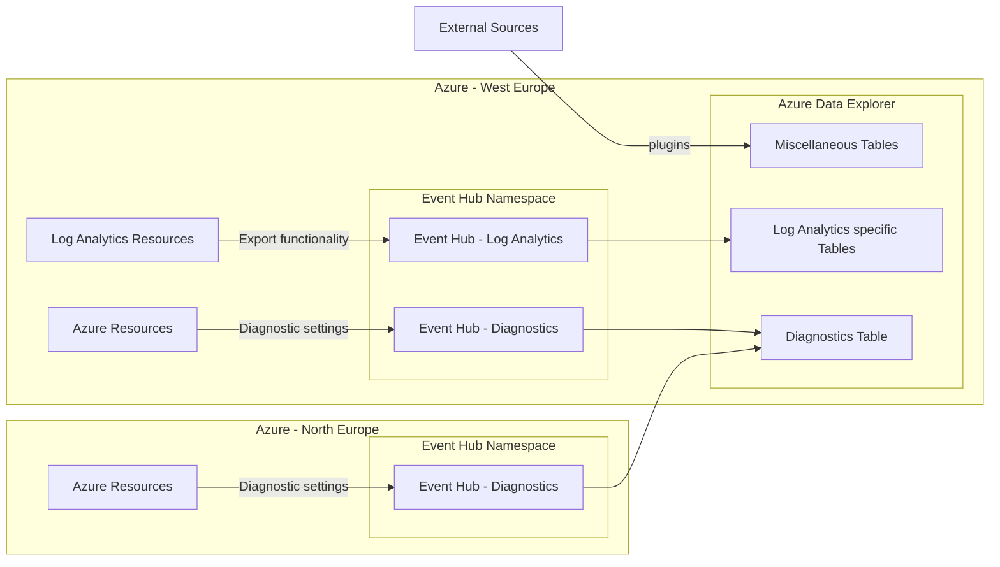

# Streaming logs from LAW to a Kusto Cluster 🤽🏻‍♂️ #

[![CC BY-NC-SA 4.0][cc-by-nc-sa-shield]][cc-by-nc-sa]

Log Analytics Workspace export to Event Hub to Kusto Cluster (Azure Data Explorer Cluster).

Some bits were from the [azure-quickstart-templates](https://github.com/Azure/azure-quickstart-templates/blob/master/quickstarts/microsoft.kusto/kusto-event-hub/main.bicep), but i took the cheapest SKUs and the simplest testable setup, batteries included.

## Configuration ##

1. `privateDnsZoneGroups` for the Kusto private endpoint can be deployed via the [policy_definition_configure_private_dns_zone_adx](/policy/policy_definition_configure_private_dns_zone_adx.json) policy, or via Bicep by setting `deployZoneGroupsViaPolicy` to `false`.

2. Create an Entra ID group for read permissions on the database, and provide the object id to the `entraIdGroupDataViewersObjectId` var in Bicep.

## Kusto extension ##

For [the Kusto Language Server](https://marketplace.visualstudio.com/items?itemName=rosshamish.kuskus-kusto-language-server) extension, that installs with the VS Code recommendations, please install specific version `3.4.1` and not `3.4.2`, because of issue [Language Server v3.4.2 not working #218](https://github.com/rosshamish/kuskus/issues/218).

## Multi-region design ##

Because Event Hubs can only connect to resources from the same region, consider the following simplified design for connecting multiple regions and sources:

## Routing options ##

Either:

1. remove the `eventHubName` element from the `Microsoft.OperationalInsights/workspaces/dataExport` to [dynamically route to an event hub with the table name](https://learn.microsoft.com/en-us/azure/azure-monitor/logs/logs-data-export?tabs=portal#event-hubs), then create a `Microsoft.Kusto/clusters/databases/dataConnections` for each event hub.
1. make the Kusto query smarter and use the `Type` column to place the records in the right table. Something [like this](https://learn.microsoft.com/en-us/kusto/management/update-policy-tutorial?view=microsoft-fabric#1---create-tables-and-update-policies), which is currently implemented in this project.

## License ##

This work is licensed under a
[Creative Commons Attribution-NonCommercial-ShareAlike 4.0 International License][cc-by-nc-sa].

[![CC BY-NC-SA 4.0][cc-by-nc-sa-image]][cc-by-nc-sa]

[cc-by-nc-sa]: http://creativecommons.org/licenses/by-nc-sa/4.0/
[cc-by-nc-sa-image]: https://licensebuttons.net/l/by-nc-sa/4.0/88x31.png
[cc-by-nc-sa-shield]: https://img.shields.io/badge/License-CC%20BY--NC--SA%204.0-lightgrey.svg
